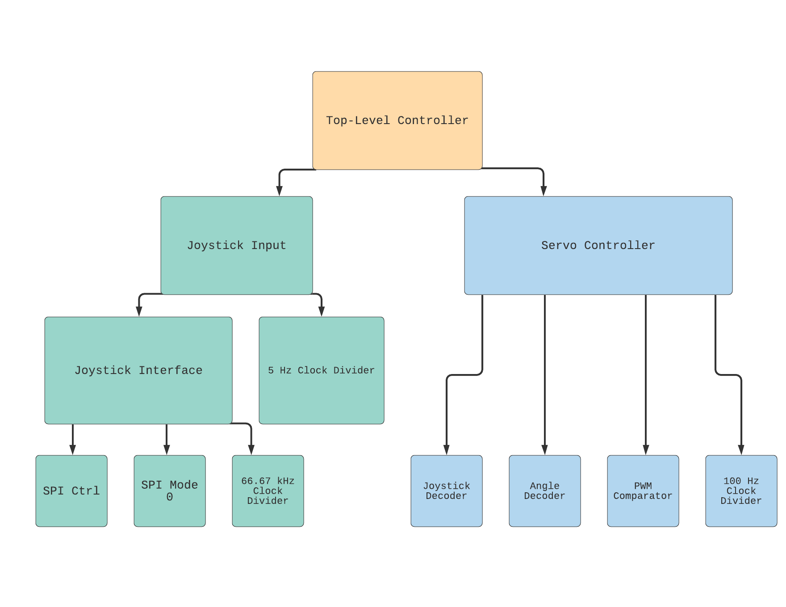
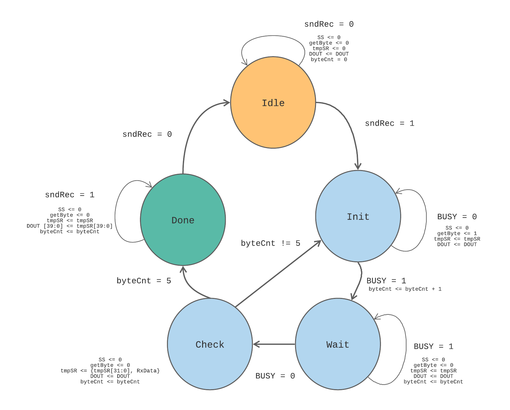
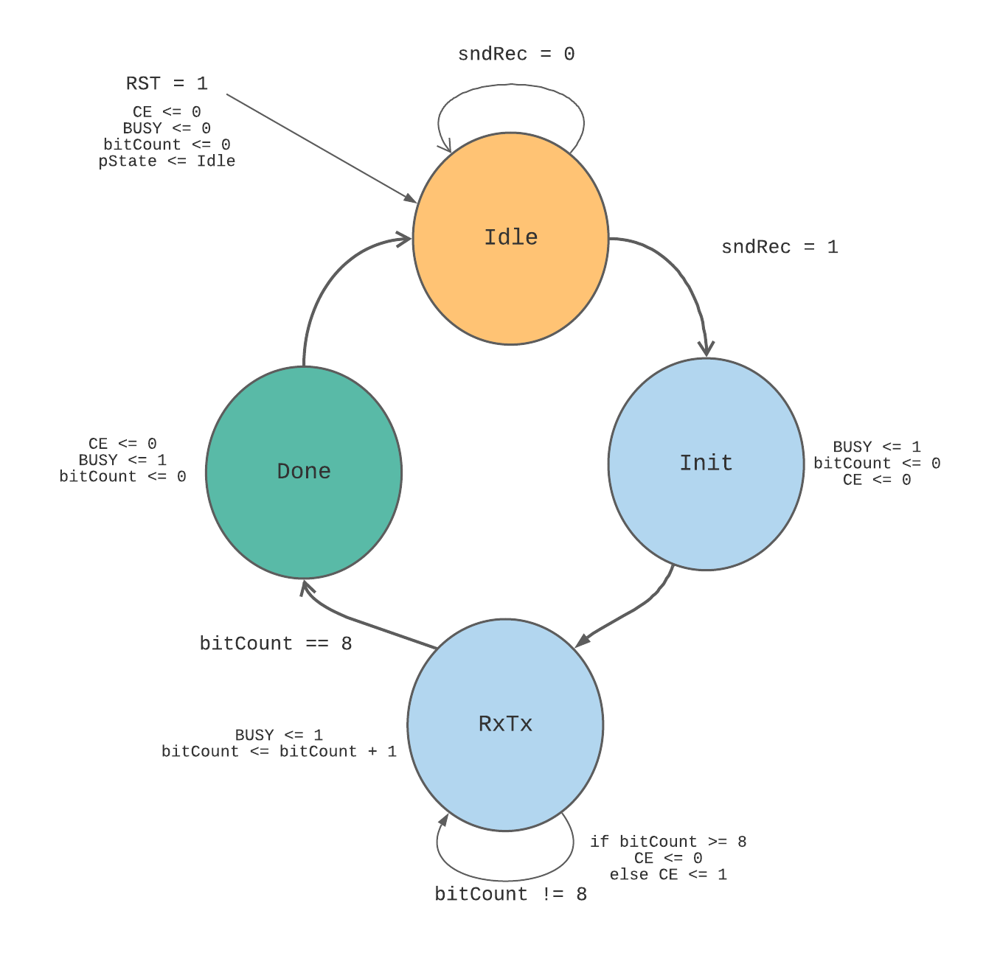

# Introduction
This repository includes the Vivado project files of my simple robot arm project for my ECE 526 class (Digital Design with Verilog and System Verilog).

Check out the `FPGA Servo Robot Arm` directory to view the Vivado project files.

[Click here to watch a short video demonstration.](https://youtu.be/SgvgNNp92zs)

# Description
Implemented in Verilog using an FPGA/SoC development board, Zedboard, this project involves the use of several servo motors to control a 3D printed robot arm. After creating the modules for generating PWM, the PWM outputs were inspected using an oscilloscope, making sure that the frequency and duty cycle values were correct. A Pmod Joystick ([JSTK2](https://digilent.com/reference/pmod/pmodjstk2/start)) was used for servo rotation via SPI. The Zedboard's push buttons were used to determine which servo should be enabled.

The overall structure is 3D printed using the [Original Prusa MINI+](https://shop.prusa3d.com/en/3d-printers/994-original-prusa-mini.html) Printer with PLA filament.

# Block Diagram

Top-Level Hierarchy:

SPI Control FSM:

SPI Mode 0 FSM:

# Building the Robot Arm

# Zedboard

# Video Demonstration Links

Short Video Demonstration:

[Video Demonstration 1](https://youtu.be/SgvgNNp92zs)

Showing the Top-Level Structure of the Project on Vivado:

[Video Demonstration 2](https://youtu.be/gucBxZ1hzhM)
